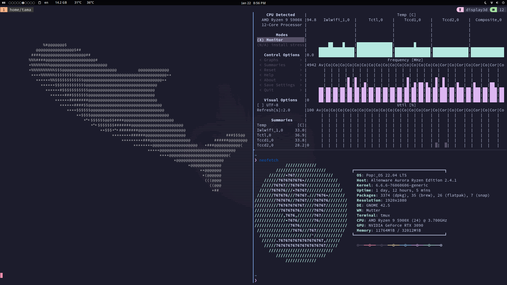

# dotfiles #

## Packages & Resources #

Some of this stuff might need some additional set up. I recommend checking out these sources for more information. I also have wacko key bindings for tmux and nvim so use them at your discretion.

[nvchad](https://nvchad.com/) - my nvim config 

[tmux](https://www.youtube.com/watch?v=DzNmUNvnB04) - how to set up tmux and its extension

[starship](https://starship.rs/) - where I get my clean terminal prompt 

## Inspiration #

The inspiration for this configuration comes from the [dotfiles by dreams of code](https://github.com/dreamsofcode-io/dotfiles). He also has a [sick youtube channel](https://www.youtube.com/@dreamsofcode) you should check out
